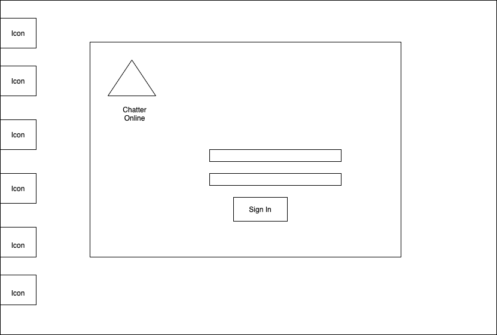
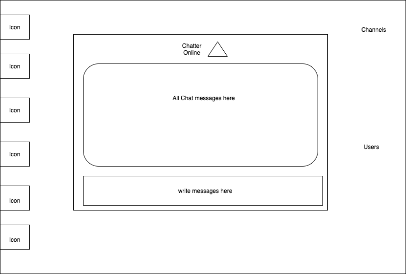

# App Title: Chatter Online

[Chatter Online](http://chatteronline-km.herokuapp.com/)

## Concept:

I loved the old school aol chat room, their real-time interaction was a huge draw and game changing in bringing more users online.  I wanted to take that concept, and pay homage to AOL in general with this app.  I wanted to build a real-time chat app that could operate similar to how their chat rooms did, with the bi-directional communication between client and server that socket.io allows it to have.

## Technologies Used:

* HTML
* CSS
* JavaScript 
* React
* Express
* nodeJS
* MongoDB
* socket.io
* Adobe Photoshop
* Adobe Illustrator


## Approach:

#### Overview
First step was to learn about WebSockets and how I could use them to create the chat app.  After researching it, it seemed easier to use socket.io, plus it provides fail-overs to other protocols in the event that WebSockets are not supported on the browser.  


#### User stories

As a user I want them to get a true feel for what it was like to login and be on AOL.  From the initial dialup on a win 95/98 PC to the look and feel of the chat rooms.

#### Wireframe




Color Pallet:

```
    #48D8F8
    #0083ff
    #022e5e
    #008081
    #f0f0f0
    #9B959E
    
```

#### Development Plan 

I really want to re-create the AOL vibe especially the very memorable process of logging in along with the modem connecting sounds.  But before that I must research websockets inside and out get a feel for them and how best to go about implememnting them in this project.  After that I want to work on setting up the full CRUD forum to allow people to post thought.memories about AOL and the chat rooms

* Development Plan part 1)  get socket.io connectio working
* Development Plan part 2)  expand on it to be able to all users
* Development Plan plan 3)  further expand to all various chat rooms 
* Development Plan plan 4)  build a full CRUD forum to post about AOL memories

#### Future Stretch goals

* Allow personal messaging
* Extend the look and feel of the AOL homepage
* Incorporate news scrapers to build out various sections
* Expand on the look and feel of the win 95 having clickable/functionable icons and programs existing on the faux desktop
####  Game Screen Shots


## Challenges faced:

Setting up socket.io originally wasn't that hard, but understanding how to create rooms and add users was a big hurdle for me to overcome.   Also working on using useState, useEffect and useRef.   


### App Demo:  [Chatter Online](http://chatteronline-km.herokuapp.com/)